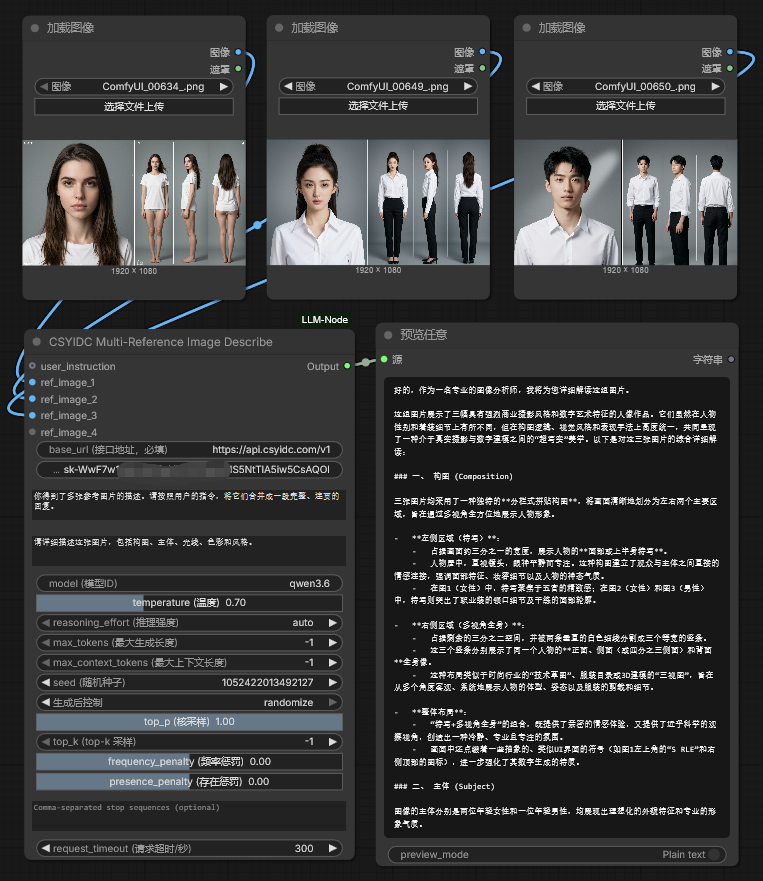

**English** · [简体中文](README_zh.md)

# ComfyUI Multi-Reference Image Describe Node

A ComfyUI custom node that talks to **any OpenAI-compatible chat/completion
endpoint** (e.g. a local vLLM/Ollama gateway, a private proxy, or any vendor
exposing an OpenAI-style REST API). There is **no built-in or default provider**
— you must supply your own `base_url`.

The node (`CSYIDC-RefDescribe`) describes up to **15 reference images**
independently with a vision-language model, then combines the descriptions into
one complete text output according to your system prompt.

---

## Node

| Node | Purpose |
|------|---------|
| **Multi-Reference Image Describe** (`CSYIDC-RefDescribe`) | Describe up to 15 reference images with a VLM, then merge them into one text output |

The node connects to your endpoint using the OpenAI **Chat Completions** format.

---

## Installation

1. Clone this repository into your ComfyUI `custom_nodes` folder.
2. `pip install -r requirements.txt`
3. Restart ComfyUI.

`numpy` and `torch` are provided by ComfyUI and do not need to be installed
separately.

> No API key or provider defaults are bundled. This is intentionally
> provider-agnostic.

---

## Configuration

Each node requires a **base_url** — the root of an OpenAI-compatible endpoint,
for example:

- `https://your-proxy.example/v1`
- `http://localhost:8000/v1` (local vLLM / llama.cpp / Ollama-compatible server)
- `https://api.deepseek.com/v1` or any OpenAI-compatible vendor

The optional **api_key** is sent as a `Bearer` token only if provided. Endpoints
that do not require auth can leave it blank.

### Model list

The **model** dropdown is populated by querying `{base_url}/models` and, if that
isn't found, `{base_url}/v1/models`. If the endpoint does not expose a model
list, or the request fails, a free-text placeholder is shown so you can type a
model id manually.

---

## Inputs & Outputs

### Required inputs

- **base_url** — your endpoint root (required).
- **api_key** — optional `Bearer` token.
- **system_prompt** — system instructions that control how the per-image
  descriptions are merged into one final output.
- **image_instruction** — the prompt used to describe each individual image.
- **model** — model id (from dropdown or typed).
- **temperature** — 0.0–2.0.
- **reasoning_effort** — `auto | none | minimal | low | medium | high | xhigh`
  (sent as `reasoning_effort` only when not `auto`).
- **max_tokens** — maximum completion length; `-1` means "not sent".
- **max_context_tokens** — approximate context-window cap for the text sent to
  the endpoint; `-1` means unlimited (no truncation).
- **seed** — integer seed.
- **top_p** — nucleus sampling (0.0–1.0).
- **top_k** — top-k sampling; `-1` means "not sent".
- **frequency_penalty** — −2.0 to 2.0.
- **presence_penalty** — −2.0 to 2.0.
- **stop** — comma-separated stop sequences (optional).
- **request_timeout** — request timeout in seconds.

### Optional inputs

- **user_instruction** — an optional instruction that frames the final combine
  step (merged together with the image descriptions).

### Dynamic image inputs

- **ref_image** inputs are dynamic: `ref_image_1` is always present; connecting
  it reveals `ref_image_2`, and so on, up to `ref_image_15`.

### Outputs

- **Output** — `STRING`; the final combined text response.

---

## How it works

1. Each connected reference image is described **independently** in its own
   request using the `image_instruction` prompt.
2. All descriptions are collected and sent back to the model together with your
   `system_prompt`, which controls how they are combined into a single,
   coherent output.
3. An optional `user_instruction` is merged in to frame the final output; the
   image descriptions are always included so the model has the full context.

> Requires a multimodal (vision) model that supports image input.

---

## Example

A ready-to-run example workflow and screenshot are provided in the [`workflow/`](workflow/)
folder.



- [workflow/llmWorkflow.json](workflow/llmWorkflow.json) — an example workflow
  that loads 3 reference images, feeds them into `CSYIDC-RefDescribe`, and
  previews the combined text output with a [PreviewAny] node.

To use it:

1. In ComfyUI, drag `workflow/llmWorkflow.json` onto the canvas (or
   **Workflow → Open** and select the file).
2. Provide your own `base_url` / `api_key` / `model` in the node (the bundled
   example uses the author's own endpoint — **replace it with yours**).
3. Connect your own reference images and run.

> **Security:** the bundled example workflow may contain an `api_key` stored in
> its widget metadata (ComfyUI stores widget values directly in the JSON). If
> you plan to share this workflow, remove/rotate the key first.

---

## Example use case: MiniMax H3 video-generation prompting

This node can be used as the "brain" for a video-generation pipeline. A typical
workflow: feed one or more reference images, ask the LLM to describe them, then
use the produced text to generate a structured, full video prompt for a
video-generation model such as **MiniMax H3**.

Below is an example **system prompt** you can place in the node's
`system_prompt`/`image_instruction` fields (or reuse as a template) so the LLM
writes a complete, format-compliant video prompt. It expects a role description
plus a reference format output:

```
You are a MiniMax H3 video-generation prompt expert. Based on the image content recognized from the pictures and the plot content provided by the user, write a complete video-generation prompt. If the user mentions dialogue lines, reflect the user's original text (in Chinese or any other language) verbatim and in full within the video-generation prompt.

Below is a complete example of a video-generation prompt. Please write your prompt following this format:

subject_definitions:
<Picture 1> is the reference image of the young woman with long loose hair, fair skin and dark eyes, wearing a lightweight white fitness-style top, standing in a cramped sci-fi environment.
<Picture 2> is the reference image of the young man with short dark hair, wearing a fitted dark crew-neck suit, also set in the same sci-fi surroundings.
<Picture 3> is the reference image of the spacecraft cabin interior, a narrow enclosed sci-fi space with curved metal walls, glowing control panels, soft blue-white lighting and floating dust in the air.

summary:
[reference generation] The target video is a 10-second cinematic sci-fi action short set inside <Picture 3>, showing <Picture 1> beginning to mutate as her eyes turn bloodshot and her pupils dilate, before she leaps into an airborne scissor takedown, whipping her body and the man around in a full rotation and landing on one knee against <Picture 2>.

retention_analysis:
<Picture 1> (female hero throughout): partially_preserved - her hair, skin, build and white top are retained, while her eyes transform to bloodshot with dilated pupils as the mutation takes hold.
<Picture 2> (male target throughout): fully_preserved - the young man's dark hair, fitted dark suit and appearance are retained across all shots.
<Picture 3> (set / environment): fully_preserved - the spacecraft cabin with its curved metal walls, glowing panels, and blue-white light is retained as the backdrop.

detailed_description:
The target video is in a gritty cinematic sci-fi action style with desaturated blue-metal tones, harsh practical lighting from glowing panels, and dynamic, unstable handheld and rapid-cut camera moves.
[Shot 1] A medium shot establishes <Picture 3>, the cramped spacecraft cabin with curved metal walls and softly glowing control panels, blue-white light flickering and thin dust hanging in the air. The young woman from <Picture 1>, in her white top with loose long hair, sways side to side unsteadily in the center, her posture rigid and strained. A slow push-in tightens as the camera edges toward her face. Cutting to a close-up, her eyes fill the frame: fine red veins appear and spread across her sclera as her dark pupils dilate unnaturally, the bloodshot effect intensifying, a low involuntary breath escaping her.
[Shot 2] At 00:03.000, the shot cuts to a medium two-shot of the young man from <Picture 2>, in his fitted dark suit, standing alert near the far wall, and the now-dilated young woman from <Picture 1> facing him. She drops into a low stance, springs explosively upward and launches her whole body into the air, twisting sideways as both legs drive out into an open scissors shape; her thighs and shins clamp around the man's neck and shoulders. Hooking her legs, she rotates her hips and torso through a full spin, carrying the man's upper body around with her in a complete 360-degree rotation before slamming down. She lands on one knee, planted firmly on the metal floor with a sharp metallic clang, the man crumpled and driven to the ground in front of her.
[Shot 3] At 00:06.000, the shot cuts to a tight close-up of the young woman's upper body from <Picture 1>, her hair disheveled and falling across her face, her bloodshot eyes with dilated pupils locked forward, breathing hard, a faint sheen of sweat on her skin under the flickering blue-white light. The camera holds a shaky close framing as her expression hardens, then begins a gentle pull-back into the dim metal gloom of the cabin as the segment ends.

overall_soundscape:
A low, tense mechanical hum of the spacecraft cabin, faint electronic beeps from the control panels, the rustle of fabric, heavy breathing, and the sharp metallic clang of the landing impact continue throughout.

non_diegetic_music:
A pulsing, brooding sci-fi score with low synth drones and a steady dark heartbeat-like pulse, intensifying during the mutation close-up and cutting sharply in the fight, then fading into uneasy silence at the end.
```

Place this as the node's `system_prompt`, describe your reference images via the
`image_instruction`, and the node will return a complete video-generation prompt
in the format above.

---

## Security note

Entering your `api_key` into the node stores it in **workflow metadata** of any
saved workflow image. For shared workflows, prefer an endpoint that doesn't
require a key, or rotate keys that get shared.

---

## Development & tests

```bash
python -m unittest discover -s tests
```

The suite mocks network/dependency modules and does not require a live endpoint.

## License

MIT
